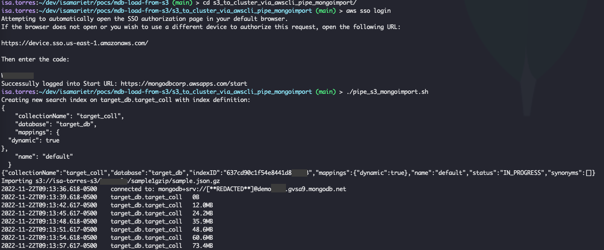

# Import data from AWS S3 to MongoDB using mongoimport

## Prerequisites
- [AWS CLI ](https://aws.amazon.com/cli/)
- [mongoimport (part of MongoDB Database Tools)](https://www.mongodb.com/docs/database-tools/installation/installation/)
- [curl](https://curl.se/)

## Setup

1. Create a copy of `sample_env.sh` and name it `env.sh`. This is where you'll add your environment variables to runt he script.
  ```
     cp sample_env.sh env.sh
  ```
2. Update the environment variables
3. Make sure that you are logged in to aws via the command line

## Run the script

```
./pipe_s3_mongoimport.sh
```
## Screenshots


